# RFD Solver Node

This project is a Python-based RFD (Request for Data) Solver Node built for the Reppo.Exchange network. It is designed to listen for data requests, route them to appropriate MCP-compliant data nodes, and process the results, with a modular architecture that supports various data-providing services.

## Architecture

The solver node operates as a smart router and processor in the data network.

1.  **RFD Listener (`pipeline.py`)**: A service that monitors a specific directory (`rfd_inbox`) for new RFD files, simulating requests coming from the network.
2.  **Router (`datasolver/router.py`)**: Reads a local service registry (`nodes.json`) to determine which external data node is responsible for fulfilling a given service request.
3.  **MCP Client (`datasolver/providers/mcp/client.py`)**: A client responsible for making remote procedure calls to external MCP-compliant servers (data nodes).
4.  **Mock Data Node (`mock_mcp_server.py`)**: A standalone, simulated external data node that hosts an MCP tool and returns mock data, used for testing the solver's routing and execution capabilities.
5.  **Solution Submission (Future)**: A planned component for publishing results, for instance to IPFS.

```mermaid
graph TD
    subgraph "External Network"
        D[Mock MCP Data Node]
    end

    subgraph "Solver Node"
        A[RFD lands in ./rfd_inbox] --> B[Pipeline Listener];
        B --> C[Router];
        C -- reads --> E[nodes.json];
        C --> F[MCP Client];
        F -- makes API call --> D;
        D -- returns data --> F;
        F --> G[Log Result to Console];
    end
```



## Setup and Installation

1.  **Clone the repository:**
    ```bash
    git clone <repository_url>
    cd rfd-solver-node
    ```

2.  **Create a virtual environment and install dependencies:**
    It is recommended to use a virtual environment.
    ```bash
    python -m venv .venv
    source .venv/bin/activate  # On Windows, use `.venv\Scripts\activate`
    pip install -r requirements.txt
    ```
    You will need to add `watchdog` and `mcp` to your `requirements.txt` file:
    ```
    watchdog
    mcp
    ```

## How to Run

Running the solver requires two separate terminal sessions: one for the mock data node and one for the main solver pipeline.

**Terminal 1: Start the Mock MCP Data Node**

This server simulates an external data provider.
```bash
uvicorn mock_mcp_server:server.app --host 127.0.0.1 --port 8001
```
You should see output indicating the server is running and listening on port 8001.

**Terminal 2: Start the RFD Solver Node Pipeline**

This is the main application that listens for requests.
```bash
python pipeline.py
```
You should see a message that the solver is watching for RFDs in the `rfd_inbox` directory.

**Terminal 3: Submit an RFD**

To test the full pipeline, create a new JSON file inside the `rfd_inbox` directory.

1.  Create a file named `nba_request.json` inside the `rfd_inbox` directory.
2.  Paste the following content into the file:

    ```json
    {
      "rfd_id": "nba_001",
      "service": "nba_player_stats",
      "metrics": ["points", "assists"],
      "season": "2024-25"
    }
    ```

3.  Save the file.

**Expected Output**

*   In the **Solver Node** terminal (Terminal 2), you will see logs indicating that the new file was detected, routed to `http://127.0.0.1:8001`, and that a result was received and printed.
*   In the **Mock Data Node** terminal (Terminal 1), you will see a log message showing that it received the RFD from the solver.

This demonstrates a successful end-to-end flow where a request is received, routed to the correct external provider, executed, and the result is returned.
